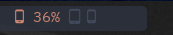
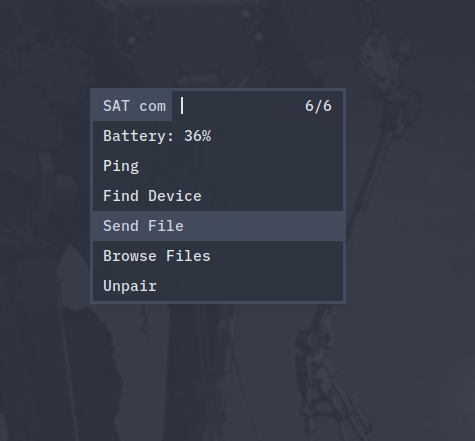
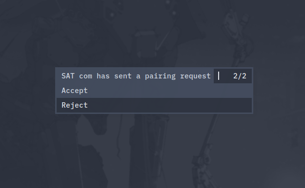

# polybar-kdeconnect

[KDEConnect](https://github.com/KDE/kdeconnect-kde) module for [Polybar](https://github.com/jaagr/polybar)






Demo with:

* [Nord Theme](https://nordtheme.com) polybar
* [Blex Mono Nerd Font](https://www.nerdfonts.com/)
* custom [dmenu](https://github.com/0jdxt/dmenu)

## Dependencies

* [dmenu](https://tools.suckless.org/dmenu)
* [kdeconnect](https://github.com/KDE/kdeconnect-kde)
* A Nerd Font
* [Zenity](https://github.com/GNOME/zenity)
* qbus-qt5 (or qt5tools on some distros)

## Usage

Place the given script in some folder, and use it in your polybar `config` as

```
[module/kdeconnect]
type = custom/script
exec = "/path/to/files/polybar-kdeconnect.sh -d"
tail = true
````

## Customization

You can change the variables in [`polybar-kdeconnect.sh`](polybar-kdeconnect.sh)
to customize the [rofi](https://github.com/DaveDavenport/rofi) menu and
the icons shown in [polybar](https://github.com/jaagr/polybar)

## Default Color Code Legend

Color | Meaning |
---|---|
 | Device Disconnected |
 | Unpaired Device |
 | Battery >= 90 |
 | Battery >= 80 |
 | Battery >= 70 |
 | Battery >= 60 |
 | Battery >= 50 |
 | Battery < 50 |

## Changelog

### v2

* Supports Multiple Devices without extra configuration
* Supports pairing/unpairing devices
* Removed `kdeconnect-cli` as dependency
* Combined seperate files into one
* Seperate icons for tablets and smartphone
